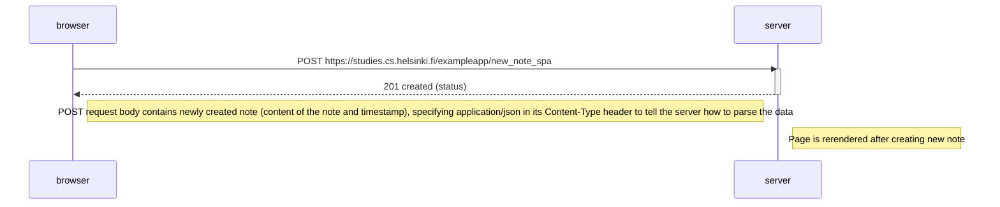

# Exercise 0.6

```mermaid
sequenceDiagram
  participant browser
  participant server

  browser->>server: POST https://studies.cs.helsinki.fi/exampleapp/new_note_spa
  activate server
  server-->>browser: 201 created (status)
  deactivate server

  Note left of server: POST request body contains newly created note (content of the note and timestamp), specifying application/json in its Content-Type header to tell the server how to parse the data

  Note right of server: Page is rerendered after creating new note
```
